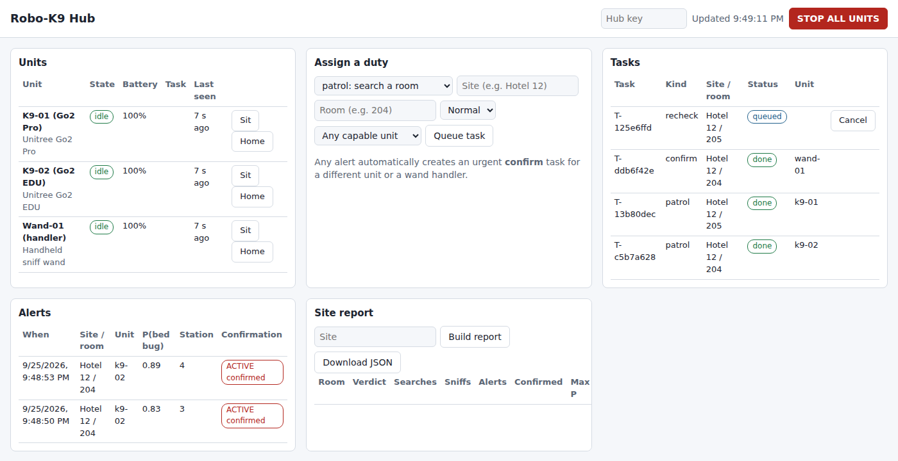

# Robo-K9 Integration: Robot Dog Link-Up and Hub

This document covers how the e-nose payload **links up with an existing robot dog** (Unitree Go2)
so the two work as one unit, and how several units, wand handlers and operators **work as one
team** through a central hub that assigns duties, collects results and writes reports.

**Yes, the plan uses an off-the-shelf robot dog.** Nothing on the robot is modified. The nose
payload bolts onto the top of the robot, talks to it through Unitree's own interfaces, and
commands it the way any app would.

| Piece | Runs on | Code |
|---|---|---|
| **Unit** = robot dog + nose payload | Raspberry Pi 5 in the nose box | [`firmware/agent.py`](firmware/agent.py), [`firmware/robot.py`](firmware/robot.py) |
| **Wand unit** = a handler with the handheld nose | Raspberry Pi 5 in the wand pack | same agent, `--robot wand` |
| **Hub** = assigns duties, collects data, reports | Any laptop, mini PC or spare Pi on site | [`hub/hub.py`](hub/hub.py), dashboard [`hub/static/index.html`](hub/static/index.html) |

---

## 1. Team overview (hub + units)

```
┌─ ROBO-K9 HUB (laptop / mini PC / Pi) ──┐    ┌ SITE ROUTER (own SSID, e.g. GL-MT3000) ┐
│ hub.py: FastAPI + SQLite               │    │ 192.168.8.0/24 · WPA3 · isolated       │
│ • registers units, assigns duties      │    │ optional LTE / internet uplink         │
│ • collects sniffs / alerts / summaries │    └────────────────────────────────────────┘
│ • auto-creates CONFIRM tasks           │    
│ • site reports, STOP ALL               │    
│ Dashboard: http://<hub-ip>:8080        │    
└────────────────────────────────────────┘    
                     │                                             │
                        HTTP, X-Hub-Key                               Wi-Fi / Ethernet
              ┌──────┴──────────────────────┬──────────────────────┴──────┬─────────────────────────────┐
              ▼                             ▼                             ▼                             ▼
┌─────── UNIT K9-01 ───────┐  ┌─────── UNIT K9-02 ───────┐  ┌──────── WAND-01 ─────────┐  ┌──────── OPERATOR ────────┐
│ Go2 Pro + nose           │  │ Go2 EDU + nose           │  │ handheld nose            │  │ phone / tablet / laptop  │
│ agent.py --robot webrtc  │  │ agent.py --robot sdk2    │  │ agent.py --robot wand    │  │ dashboard in browser     │
└──────────────────────────┘  └──────────────────────────┘  └──────────────────────────┘  └──────────────────────────┘

 All traffic stays on the site network. Units pull work from the hub (no open ports on the robots).
```

**Why the units pull instead of the hub pushing:** robots move between Wi-Fi cells and drop out.
With the pull model, a unit that loses Wi-Fi just catches up when it reconnects, and nothing
on the robot has to accept incoming connections. If a unit goes silent for 60 s, the hub puts
its task back in the queue for another unit.

---

## 2. Link-up schematic: Go2 Pro / Air (Wi-Fi)

```
┌─────── UNITREE GO2 PRO / AIR ────────┐                 ┌────── NOSE PAYLOAD: RASPBERRY PI 5 ──────┐
│ Wi-Fi: joins site SSID (STA mode,    │                 │ wlan0 → site SSID, e.g. 192.168.8.30     │
│ set in the Unitree Go app)           │                 │ ROS 2 Jazzy:                             │
│ e.g. 192.168.8.20                    │                 │   go2_ros2_sdk driver (ROBOT_IP=.20)     │
│ WebRTC data channel:                 │   ◄── Wi-Fi ──► │   slam_toolbox (map) + Nav2              │
│   sport API, LiDAR, IMU, odometry,   │    WebRTC over  │   agent.py → hub                         │
│   battery, video                     │    site router  │ I2C / GPIO → e-nose (SCHEMATICS §3)      │
│                                      │                 │ CSI → Camera Module 3                    │
│ Built-in 4D LiDAR (L1)               │                 │                                          │
│ Own battery: runs the robot only     │                 │ Power: own 12 V pack → 5 V buck          │
└──────────────────────────────────────┘                 └──────────────────────────────────────────┘

 Mechanical: 3 mm Al plate on the Go2's top accessory mount points. Check hole positions and
 thread size on your unit before drilling. Nose box on the plate, snout boom along the chest.
 No electrical connection between robot and payload: the only link is Wi-Fi.
```

**Steps**
1. In the Unitree Go app, switch the Go2 to **STA mode** and join the site router's SSID. Give it a DHCP reservation (e.g. 192.168.8.20).
2. On the Pi: install ROS 2 Jazzy and [go2_ros2_sdk](https://github.com/abizovnuralem/go2_ros2_sdk). Set `ROBOT_IP` to the Go2's address and the connection type to WebRTC, as its README describes, then launch the driver. It publishes LiDAR, odometry, joint states and battery, and takes sport commands on `/webrtc_req`.
3. Build the room map once with slam_toolbox (tele-op the robot around the room), save it, and run Nav2 on that map.
4. Start the agent: `python agent.py --hub http://<hub-ip>:8080 --key $HUB_KEY --unit-id k9-01 --robot webrtc --model model.joblib --stations stations.json`.

**Power:** the Air/Pro has no official accessory power outlet, so the payload carries its own 12 V pack (SCHEMATICS §3a).
Don't tap the robot's battery.

---

## 3. Link-up schematic: Go2 EDU (Ethernet + dock power)

```
┌────────── UNITREE GO2 EDU ───────────┐   ┌─────── NOSE PAYLOAD: RASPBERRY PI 5 ───────┐
│ Internal switch 192.168.123.0/24     │   │ eth0 static 192.168.123.222/24             │
│   motion MCU  192.168.123.161        │   │   CycloneDDS: unitree_sdk2 SportClient,    │
│   Jetson      192.168.123.18         │   │   rt/lowstate, LiDAR, odometry             │
│ Expansion dock:                      │   │ wlan0 → site SSID → hub                    │
│   [A] Ethernet port                  │   │ ROS 2: slam_toolbox + Nav2, agent.py       │
│   [B] DC power outlet                │   │ I2C / GPIO → e-nose, CSI → camera          │
│ Built-in 4D LiDAR, DDS topics        │   │ Power: D36V50F5 5 V buck (≤ 50 V in)       │
└──────────────────────────────────────┘   └────────────────────────────────────────────┘

 [A] Ethernet port ─── Cat6 patch, 0.3 m ──────────────────────► Pi 5 eth0
 [B] DC power outlet ─ 5 A inline fuse ─► D36V50F5 VIN ─► 5 V rail ─► Pi 5 + nose (SCHEMATICS §3a)

 The payload runs from the robot's battery, so no separate pack is needed. Read the dock's rated
 voltage and current on your unit and keep the payload's draw well under it (≈ 11 W avg / 30 W peak).
 Pick a static IP not already used on 192.168.123.x (.161 and .18 are the robot's own).
```

**Steps**
1. Plug the Pi's Ethernet into the EDU expansion dock and give `eth0` a static address on 192.168.123.0/24.
2. Install [unitree_sdk2_python](https://github.com/unitreerobotics/unitree_sdk2_python) (CycloneDDS). Check it works with the SDK's examples before adding the nose.
3. Map and navigate as on the Pro (slam_toolbox + Nav2 on the Pi, or on the EDU's own Jetson).
4. Start the agent with `--robot sdk2 --robot-model "Unitree Go2 EDU"`.

---

## 4. Software link-up inside one unit

```
┌─────────────────────── RASPBERRY PI 5 (one unit) ────────────────────────┐
│ agent.py ──── HTTP ────────────────────────────────────► HUB             │
│   │   heartbeat 5 s ◄── commands: stop / sit / stand / home / abort      │
│   │   next-task ◄── duty: patrol | recheck | confirm | calibrate         │
│   │   events ──► sniff (p, station, pose) · alert · done / failed        │
│   │                                                                      │
│   ├── robot.py ── Go2WebRtc ── /webrtc_req ──► go2_ros2_sdk ──► Go2      │
│   │              Go2Sdk2 ─── SportClient (DDS, eth0) ─────────► Go2      │
│   │              Nav2 BasicNavigator ◄── slam_toolbox map + LiDAR        │
│   │                                                                      │
│   └── detector.NoseScorer ── nose.py ── I2C mux ── sensor array          │
│                          └── sniff_logger.run_sniff ── valve / pump      │
└──────────────────────────────────────────────────────────────────────────┘
```

| Robot action | Go2 Pro/Air (`Go2WebRtc`) | Go2 EDU (`Go2Sdk2`) |
|---|---|---|
| Walk to a sniff station | Nav2 `goToPose` | Nav2 `goToPose` |
| Nose-down sniff posture | sport `StopMove` + `Euler(pitch 0.30 rad)` | `SportClient.StopMove()` + `Euler()` |
| **Alert = SIT** | sport `StopMove` + `Sit` | `SportClient.Sit()` |
| Stand back up | `RiseSit` + `BalanceStand` | `RiseSit()` + `BalanceStand()` |
| Emergency stop | Nav2 cancel + `StopMove` | Nav2 cancel + `StopMove()` |

Sport-mode API ids live in one table, `SPORT_API` in `robot.py`. **Check them against the Go2 firmware
and SDK versions you install**, because Unitree has changed them between releases. The robot's own
remote-control e-stop always overrides everything here.

---

## 5. The hub: duties, data and reports



*Screenshot of the hub running a full simulation: two robot units and one wand unit, fake bed bug hot spot in room 204.*

### 5.1 Duties the hub can assign

| Duty | Who can take it | What the unit does | What it reports |
|---|---|---|---|
| **patrol** | Units with `patrol` (the dogs) | Walks every sniff station in the room, 3 sniffs each. **Sits** after 2 hits in a row | Every sniff (P, station, pose), each alert, a summary |
| **recheck** | same | Same as patrol, used for follow-up after treatment | same |
| **confirm** | Units with `confirm` (dogs or wands) | Goes to the alert spot and takes 5 sniffs. Confirmed if ≥ 2 are over the threshold | confirmed yes/no, all P values |
| **calibrate** | Units with `nose` | Reference vial ×3, blank ×3 | pass/fail, P values (drift check) |

### 5.2 Rules the hub applies automatically
- **Second opinion:** an alert on a patrol creates an **urgent confirm task** for a *different* unit or a wand
  handler, never the unit that alerted. Alerts within 0.5 m of an open confirm task share it.
- **Right unit for the job:** each duty needs a capability. A wand never gets sent on a patrol, and you can also target one unit by name.
- **Priority:** urgent (1) before normal (3) before low (5), then oldest first.
- **Nothing gets lost:** a unit silent for 60 s is marked offline and its running task goes back in the queue.
- **One task, one unit:** tasks are claimed in a locked transaction, so two units polling at the same moment can't both take it.
- **Operator control:** Stop all, per-unit Sit / Home, and cancel a task (which aborts it on the unit).
  Commands ride on the next heartbeat reply, so they arrive within about 5 s.

### 5.3 A mission, start to finish

```
Operator                 Hub                     K9-01 (dog)                 K9-02 (dog)               Wand-01
    ├── queue 204 + 205 ─►│                           │                           │                       │
    │                     │◄─ next-task ──────────────┤                           │                       │
    │                     ├── patrol 204 ────────────►│                           │                       │
    │                     │◄─ next-task ──────────────────────────────────────────┤                       │
    │                     ├── patrol 205 ────────────────────────────────────────►│                       │
    │                     │                           │ walks stations, sniffs    │                       │
    │                     │◄─ sniff events ───────────┤                           │                       │
    │                     │                           │ 2 hits in a row: SITS     │                       │
    │                     │◄─ ALERT st.4, p=0.89 ─────┤                           │                       │
    │                     │ auto: CONFIRM 204         │                           │                       │
    │                     │ (not K9-01)               │                           │                       │
    │                     │◄─ next-task ──────────────────────────────────────────────────────────────────┤
    │                     ├── confirm 204, station 4, r = 0.5 m ─────────────────────────────────────────►│
    │                     │                           │                           │                       │ probes seams
    │                     │◄─ done: confirmed (4 of 5 sniffs) ────────────────────────────────────────────┤
    │                     │◄─ done: 205 clear ────────────────────────────────────┤                       │
    │◄─ site report ──────┤                           │                           │                       │
    │ 204 ACTIVE          │                           │                           │                       │
    │ 205 CLEAR           │                           │                           │                       │
```

### 5.4 Room verdicts in the site report

| Verdict | Meaning |
|---|---|
| **ACTIVE - confirmed** | At least one alert was confirmed by a second unit or a wand |
| **SUSPECT - confirmation pending** | Alert raised, confirm task still queued or running |
| **SUSPECT - alert with no confirmation** | Alert raised but no confirm was run (e.g. it was cancelled) |
| **CLEAR - alerts not confirmed** | Alerts happened but the second opinion didn't back them up |
| **CLEAR** | Searched, no alerts |
| **NOT SEARCHED** | Task queued or failed (e.g. room not mapped yet) |

The report can be downloaded as JSON from the dashboard. It lists, per room: searches, sniffs, alerts,
confirmations, the highest P(bed bug) seen, and which units took part.

### 5.5 Hub API (all calls need the `X-Hub-Key` header)

| Method + path | Used by | Purpose |
|---|---|---|
| `POST /api/units/register` | unit | Join the team with capabilities |
| `POST /api/units/{id}/heartbeat` | unit | State, battery, pose → gets back any pending command |
| `POST /api/units/{id}/next-task` | unit | Claim the most urgent task it can do |
| `POST /api/tasks/{id}/events` | unit | progress / sniff / alert / done / failed |
| `POST /api/tasks` | operator | Queue a duty `{kind, site, room, priority, target_unit, params}` |
| `POST /api/tasks/{id}/cancel` | operator | Cancel (aborts it on the unit if running) |
| `POST /api/units/{id}/command` | operator | `stop`, `sit`, `stand`, `return_home`, `abort_task` |
| `POST /api/stop-all` | operator | Stop every unit |
| `GET /api/units`, `/api/tasks`, `/api/alerts`, `/api/reports/{site}` | dashboard | Live views and reports |

---

## 6. Network and security

- Run the team on its **own SSID / VLAN**, and don't put robots on a client's guest Wi-Fi. A travel router like the GL.iNet GL-MT3000 is enough.
- Set a long random `HUB_KEY`. Every unit and the dashboard use it.
- For remote viewing, put the hub behind a VPN (e.g. Tailscale or WireGuard) rather than opening a port to the internet.
- Keep the Go2 firmware updated and isolated. Consumer robot dogs have had published vulnerabilities (BUILD_PLAN §7).
- The hub stores only sniff scores, poses and summaries, no camera images, so client privacy is simple to explain.

---

## 7. Extra parts for the link-up

| Part | Qty | ~$ | Buy | Notes |
|---|---|---|---|---|
| Travel router, e.g. GL.iNet GL-MT3000 (Beryl AX) | 1 per team | 90 | [GL.iNet](https://www.gl-inet.com/products/gl-mt3000/) | Private site network for hub + units |
| Hub computer: any laptop, or a Raspberry Pi 5 4 GB + case + SSD | 1 per team | 0–120 | [raspberrypi.com](https://www.raspberrypi.com/products/raspberry-pi-5/) | Runs `hub.py`. Very light load |
| Cat6 patch cable, 0.3 m (EDU only) | 1 per EDU unit | 5 | any | Pi eth0 → dock |
| Fused DC lead to dock connector (EDU only) | 1 per EDU unit | 10 | match your dock's connector | 5 A inline fuse |
| Tablet or phone for the operator | 1 | own | – | Dashboard runs in any browser |

---

## 8. Try it with no hardware (simulation)

```bash
# terminal 1: hub
cd robot-scent-dog/hub && pip install -r requirements.txt
HUB_KEY=demo uvicorn hub:app --port 8080
# terminals 2-4: two simulated dogs and a simulated wand, bed bug hot spot at (2.0, 1.0)
cd robot-scent-dog/firmware
python agent.py --hub http://localhost:8080 --key demo --unit-id k9-01 \
    --robot sim --nose sim --sim-hotspot 2.0,1.0 --stations stations.example.json
python agent.py --hub http://localhost:8080 --key demo --unit-id k9-02 \
    --robot sim --nose sim --sim-hotspot 2.0,1.0 --stations stations.example.json
python agent.py --hub http://localhost:8080 --key demo --unit-id wand-01 \
    --robot wand --caps confirm,nose --nose sim --sim-hotspot 2.0,1.0
# open http://localhost:8080, enter key "demo", queue patrols for site "Hotel 12", rooms 204 and 205
```

**Result of this simulation:** the two dogs split the rooms. The dog that got room 204 alerted twice near the
hot spot and sat. The hub opened one confirm task and sent it to the wand, which confirmed it. The report came back
**204 ACTIVE - confirmed, 205 CLEAR**. A room with no mapped stations failed cleanly and was marked NOT SEARCHED.
Hub tests: `cd hub && pytest -q` (9 tests: claiming, auto-confirm, capabilities, requeue, stop-all, verdicts).
