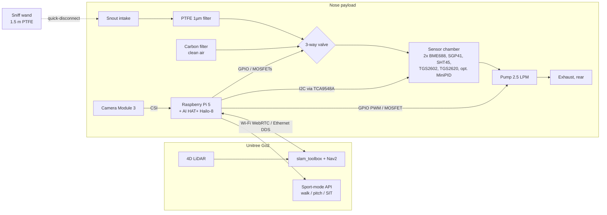

# Robo-K9 Schematics

These cover the system, the airflow (pneumatics), the electronics, power, and the mechanical parts.
Part numbers (#) refer to the BOM in [BUILD_PLAN.md §4](BUILD_PLAN.md#4-bill-of-materials-with-purchase-links).

---

## 1. System block diagram



---

## 2. Airflow (pneumatic) schematic

### 2a. Base system (Phases 0–2)

```
                       ┌──────────── sample path (PTFE only) ────────────┐
                       │                                                  │
 SNOUT  ──►  [QD]  ──► [F1 PTFE 1µm] ──►  NC ┐                            │
 (stainless 1/4" tube,                        │                           │
  intake 2–8 cm from surface)            ┌────┴────┐                      │
                                         │  V1     │ COM ──► [ SENSOR  ] ──► [PUMP P1] ──► EXHAUST
 ROOM AIR ──► [F2 carbon] ──► [F2 carbon]►  NO     │         [ CHAMBER ]      (downstream,   (points to rear,
             (2 in series = clean purge)  │ 3-way  │                           silicone OK)   away from snout)
                                         └─────────┘
 V1 de-energized (default) : NO→COM  = CLEAN AIR  (purge / baseline, fail-safe)
 V1 energized              : NC→COM  = SAMPLE     (sniff)
```

**Sniff cycle** (set in `firmware/sniff_logger.py`):

| Step | Time | V1 | P1 | What the sensors see |
|---|---|---|---|---|
| PURGE | 20 s | off (clean) | 100 % | Carbon-filtered air → baseline R0 |
| SNIFF | 5 s | **on (sample)** | 100 % | Sample fills the chamber (~0.5 s exchange) |
| HOLD | 10 s | off | 0 % | Static sample. MOS response peaks, heater profiles sweep |
| (repeat) | | | | Features = response vs. baseline, per sensor |

**Rules for the sample path:**
- Everything from the snout to the chamber must be PTFE, stainless steel, glass or aluminium.
- Keep the tube from the snout to the chamber under 40 cm, or 1.5 m on the wand. Shorter means less stickiness and faster response.
- The pump goes **downstream** of the chamber. Its exhaust points backward so the robot doesn't re-sniff it.

### 2b. Phase 3 add-on: Tenax TA preconcentrator

```
 SNOUT ──► F1 ──► NC ┐                                   ┌──► V1 (NC port)
                    V2 3-way ──► [ TENAX TRAP ] ──► V3 ──┤
 CLEAN ──► F2 ──► NO ┘          (1/4" SS tube,     3-way └──► DUMP (to pump inlet via tee)
                                 ~60 mg Tenax TA,
                                 polyimide heater H1
                                 + 10k NTC on ADS A3)

 1. TRAP    60 s : V2=sample, V3=dump,  P1 on    → VOCs adsorb, water mostly passes through
 2. HEAT     5 s : V2=clean,  V3=dump,  P1 off   → H1 heats the trap to ~180 °C (PWM, NTC feedback)
 3. DESORB   5 s : V2=clean,  V3=→V1, V1=sample, P1 20 %  → concentrated burst into the chamber
 4. COOL/PURGE 30 s
```

---

## 3. Electrical schematic

### 3a. Power tree

```
 12 V Li-ion pack (#30) ── F 5 A fuse ──┬──────────────────────────────► 12 V rail
  (or Go2 EDU dock 12 V/24 V*)          │                                 ├─► V1 valve (via Q2)
                                        │                                 └─► H1 Tenax heater (via Q3, Phase 3)
                                        │
                                        └─► Pololu D36V50F5 (#27) ─────► 5 V rail (5.5 A)
                                               VIN   VOUT                  ├─► Pi 5 (USB-C pigtail or GPIO pins 2/4)
                                               GND   GND                   ├─► P1 pump (via Q1)
                                               PG ──► GPIO6 (optional)     ├─► TGS2602 + TGS2620 heaters (VH = 5.0 V)
                                                                           ├─► Buzzer (via Q4)
                                                                           └─► MiniPID supply (Phase 3)
                                        Pi 5 3V3 pin 1/17 ────────────► 3.3 V rail: STEMMA QT sensors, ADS1115,
                                                                         Figaro sensing circuit VC

 * On the Go2 EDU dock the D36V50F5 accepts up to 50 V in, so it can run from the 24 V outlet.
 If you power the Pi 5 through the GPIO 5 V pins, add  usb_max_current_enable=1  to /boot/firmware/config.txt.
 All grounds are tied at one star point on the Perma-Proto HAT.
```

### 3b. Low-side MOSFET drivers (x4, IRLB8721 #28), all the same

```
            +V_LOAD (5 V for P1/Q4, 12 V for V1/H1)
               │
          ┌────┴────┐
          │  LOAD   │      D1 1N5819 across the load:
          │ (pump / │◄───  cathode to +V_LOAD, anode to drain
          │  valve) │      (skip the diode on the resistive heater H1)
          └────┬────┘
               │ Drain
 GPIO ──[100 Ω]──┤ Gate   IRLB8721
               │         (TO-220, G-D-S left to right)
        [10 kΩ]│ Source
               │   │
              GND GND

 Q1: GPIO18 (pin 12, PWM)  → P1 pump            5 V, ~0.5 A
 Q2: GPIO23 (pin 16)       → V1 3-way valve     12 V, ~0.2 A
 Q3: GPIO24 (pin 18, PWM)  → H1 Tenax heater    12 V, ~1 A   (Phase 3)
 Q4: GPIO25 (pin 22)       → Buzzer (active)    5 V, ~30 mA
```

### 3c. Figaro TGS2602 / TGS2620 circuit (x2, the same)

```
  TGS26xx, bottom view (TO-5, 4 pins)          Wiring
        ┌───────┐
        │ 1   2 │    Pin 1 = Heater         5 V rail ── pin 1
        │ 4   3 │    Pin 4 = Heater         pin 4 ── GND           (VH = 5.0 V ±0.2)
        └───────┘    Pin 3 = Sensor (+)     3.3 V ── pin 3          (VC = 3.3 V keeps Vout ≤ 3.3 V for the ADS1115)
                     Pin 2 = Sensor (−)     pin 2 ──┬── ADS1115 A0 (TGS2602) / A1 (TGS2620)
                                                    │
                                                  [RL 10 kΩ 1 %]
                                                    │
                                                   GND
  Rs = RL × (VC − Vout) / Vout        (computed in firmware; features use Rs/Rs0)
  Heater power: TGS2602 ≈ 280 mW, TGS2620 ≈ 210 mW. Burn in for 48 h before use.
  (The datasheet characterises VC = 5 V. At 3.3 V the ratios Rs/Rs0 still work; only the absolute Rs shifts.)
```

### 3d. I2C tree

```
 Pi 5  GPIO2 SDA (pin 3) ─┐
       GPIO3 SCL (pin 5) ─┤  STEMMA QT
       3V3 (pin 1), GND ──┘
                         │
                 ┌───────┴────────┐
                 │ TCA9548A 0x70  │ (#7)
                 └┬──┬──┬──┬──┬───┘
             ch0  │  │  │  │  │ ch4
     BME688 "A" ──┘  │  │  │  └── ADS1115 0x48 (#6): A0 TGS2602, A1 TGS2620, A2 MiniPID, A3 Tenax NTC
     0x77 (#1)       │  │  └───── SHT45 0x44 (#5), chamber reference T/RH
                     │  └──────── SGP41 0x59 (#2)
     BME688 "B" ─────┘ ch1
     0x77 (#1)   (same address, so it needs its own mux channel. Runs a different heater setpoint)
```

### 3e. Raspberry Pi 5 header map

| Pin | GPIO | Function | Connects to |
|---|---|---|---|
| 1 | 3V3 | 3.3 V out | STEMMA QT V+, Figaro VC, NTC divider |
| 2, 4 | 5V | 5 V in (optional) | D36V50F5 VOUT |
| 3 | GPIO2 | I2C1 SDA | TCA9548A SDA |
| 5 | GPIO3 | I2C1 SCL | TCA9548A SCL |
| 6, 9, 14… | GND | Ground | Star ground |
| 12 | GPIO18 | PWM0 | Q1 gate → pump P1 |
| 16 | GPIO23 | Output | Q2 gate → valve V1 |
| 18 | GPIO24 | PWM (software) | Q3 gate → Tenax heater H1 |
| 22 | GPIO25 | Output | Q4 gate → buzzer |
| 29 | GPIO5 | Input, pull-up | Wand trigger button → GND |
| 31 | GPIO6 | Input | Buck regulator PG (optional) |
| 36 | GPIO16 | Output | Alert LED (330 Ω → LED → GND) |
| CAM0 | CSI | Camera | Camera Module 3 (#26) |
| PCIe | FFC | PCIe x1 | AI HAT+ (#25) |

**Stack order:** Pi 5 → Active Cooler → AI HAT+ (with its stacking header) → Perma-Proto HAT (MOSFET drivers, Figaro circuits, connectors).

---

## 4. Power budget

| Load | Rail | Avg W | Peak W |
|---|---|---|---|
| Pi 5 (active, ROS 2 + ML) | 5 V | 5.0 | 8.0 |
| AI HAT+ (only runs at alert stations) | 5 V | 0.5 | 2.5 |
| Camera Module 3 | 5 V | 0.3 | 1.0 |
| Pump P1 (~70 % duty) | 5 V | 1.8 | 2.5 |
| TGS2602 + TGS2620 heaters | 5 V | 0.5 | 0.5 |
| BME688 ×2, SGP41, SHT45, ADS1115, mux | 3.3 V | 0.1 | 0.2 |
| Valve V1 (~15 % duty) | 12 V | 0.4 | 2.4 |
| Tenax heater H1 (Phase 3, ~10 % duty) | 12 V | 1.2 | 12 |
| Buck efficiency loss (~90 %) | – | 0.9 | 1.5 |
| **Total** | | **≈ 10.7 W** | **≈ 30 W** |

A 12 V 6 Ah pack (72 Wh) gives about **5–6 hours**, which is longer than the Go2's own 1–4 hour runtime.

---

## 5. Mechanical

### 5a. Sensor chamber (6061 aluminium, #17)

```
 TOP VIEW (lid off)                                  SECTION A-A
 ┌────────────────── 60 ──────────────────┐          ┌──────────────── lid: 3 mm Al plate ─────────────┐
 │  ○ M3                              M3 ○ │          │  [BME A] [BME B] [SGP41] [SHT45]  (boards face  │
 │   ┌──────────── 40 × 20 ───────────┐   │ 40       │   ▼▼▼     ▼▼▼     ▼▼▼     ▼▼▼      down, over    │
 │ ◄─┤   cavity 8 mm deep (~6.4 mL)   ├─► │          │  ═══ 1 mm PTFE gasket, windows under each ═══   │
 │ IN└────────────────────────────────┘OUT│          │  ┌──── cavity 8 mm ────────────────────────┐    │
 │  ○ M3   ◎TGS2602   ◎TGS2620       M3 ○ │          │ ─┘ IN 1/8" barb                  OUT barb └─   │
 └────────────────────────────────────────┘          └────────── 20 mm block ───────────────────────────┘
  ◎ = 9.5 mm holes in the lid for the TO-5 cans, sealed with Viton O-rings (the sensing face points into the cavity)
  Inlet and outlet at opposite ends so the flow sweeps past every sensor. 1/8" NPT tapped, PP or SS barbs.
  At ~1 L/min through 6.4 mL the air is fully replaced in about 0.4 s.
```

### 5b. Snout and mount on the Go2

```
        SIDE VIEW
                        ┌──────── nose box (enclosure #35) ────────┐
                        │ Pi5+HAT stack │ chamber │ pump │ battery │   ← 3 mm Al plate bolted
                        └───────┬──────────────────────────────────┘     to Go2 top rails
     snout boom                 │ PTFE line (≤40 cm)                     (≤ 3 kg total)
   (1/4" SS tube,  ◄────────────┘
    clamps to chest)
          \
           \   intake angled 30° down
            ▼  ~8 cm above floor standing, 2–3 cm with body pitched nose-down
   ─────────────────────────────── floor ───────────────────────────────
   Camera Module 3 zip-mounted beside the intake, pointing at the sniff spot.
   The exhaust leaves the rear of the box, pointing up and back.
```

### 5c. Sniff wand (Phase 1+)

```
  [QD male]══════ 1.5 m PTFE 1/8" ID ══════[handle: 25 mm PVC tube]──[SS tip 1/4" × 100 mm, 45° bend]
                                              │
                                              └ push button (to GPIO5) on a 2-core cable taped along the tube
  Press = one SNIFF cycle, tagged in the log as "wand".
```
